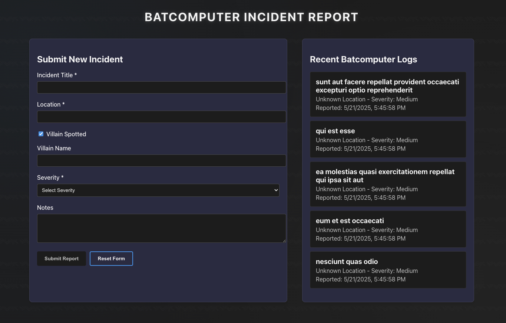

# React Test – Batcomputer Incident Report

**Time Limit:** 45 minutes  
**Tech Stack:** React (functional components)

---

## Submission Instructions

1. **Create a new public GitHub repository** under your own account.
2. Name the repo using this format:

For example: `jawwad_abbasi-kodelle`

3. Push your completed React project to that repository.
4. Submit the **link to the GitHub repo** once you're done.

---

## Scenario

Batman needs a lightweight interface to submit and review nightly incident reports into the Batcomputer. Your task is to build a mini React app that:

- Lets Batman **submit new incident reports**
- **Fetches recent incidents**
- Manages form state and integrates with a public API
- **Persists data** using localStorage for offline access

---

## Requirements

### 1. Create a Form with the following fields:

| Field           | Type                       | Required? |
|----------------|-----------------------------|-----------|
| Incident Title | Text input                  | ✅        |
| Location       | Text input                  | ✅        |
| Villain Name   | Text input                  | ❌        |
| Severity       | Dropdown (Low/Medium/High)  | ✅        |
| Notes          | Multiline Textarea          | ❌        |

- All inputs should be **controlled** using `useState`
- Validate required fields before submission
- Store submitted data in localStorage for persistence

---

### 2. Submit the Form

- On submit, **POST the data** to:

  ```
  https://jsonplaceholder.typicode.com/posts
  ```

- Show a simple **success message** when the submission is successful
- Clear the form afterward
- Save the submitted incident to localStorage

---

### 3. Fetch Recent Incidents

- On page load, check localStorage for existing incidents first
- If no stored incidents, **GET recent incidents** from:

  ```
  https://jsonplaceholder.typicode.com/posts?_limit=5
  ```

- Display them under the heading:  
  **Recent Batcomputer Logs**

- Show the **incident title** for each

---

### 4. Buttons

- `Submit Report` (only active if required fields are filled)
- `Reset Form` to manually clear the form (optional)

---

## Technical Requirements

- Use React with `useState` and `useEffect`
- No Redux or external libraries (CSS optional)
- Keep code clean, modular, and readable
- Handle loading and error states where appropriate
- Implement localStorage for data persistence

---

## Optional Styling (Bonus)

- Dark mode background (`#0b0b3b`)
- White card layout for form
- Styled error/success messages
- Light animations/transitions

---

## Bonus Features (if time allows)

- Show inline validation errors
- Add a "Villain Spotted" checkbox → only then show "Villain Name" input
- Display severity with color-coded badges in the incident list

---

## 💻 Sample UI Preview

Here’s what the form might look like (you don’t have to match this exactly):



---

## 🦇 Gotham is counting on you.